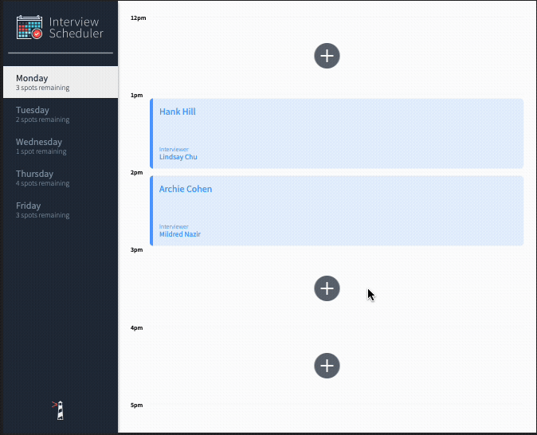

# Interview Scheduler

Interview Scheduler is a single-page application (SPA) that allows users to book technical interviews between students and mentors. Appointments can be between the hours of 12 PM and 5 PM, Monday to Friday. Each appointment has one student and one interviewer. When creating a new appointment, the user can enter any student name while the interviewer is chosen from a predefined list. The user can save the appointment and view the entire schedule of appointments on any day of the week. Appointments can also be edited or deleted. The front end of this project is built with React and makes requests to an API to fetch and store appointment data from a database.

## Final Product

### Homepage


### Selecting Days


### Creating New Appointment


### Editing Appointment


### Deleting Appointment


### Error Handling




## Setup

Install dependencies with `npm install`.

## Instructions

- Run scheduler-api in it's project folder

```sh
npm start
```

- Run scheduler in it's project folder

```sh
npm start
```

## Dependencies

- axios
- classnames
- normalize.css
- React
- React-dom
- React-scripts
